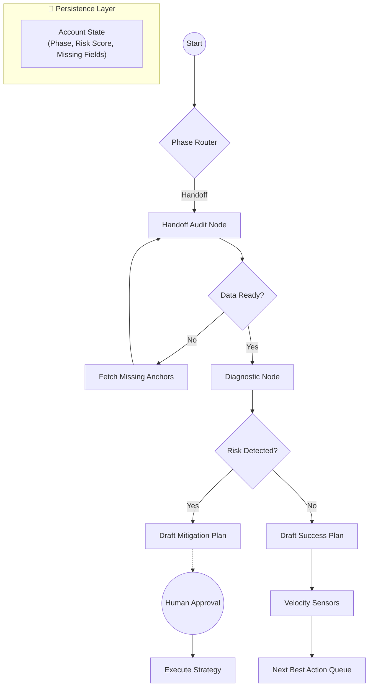
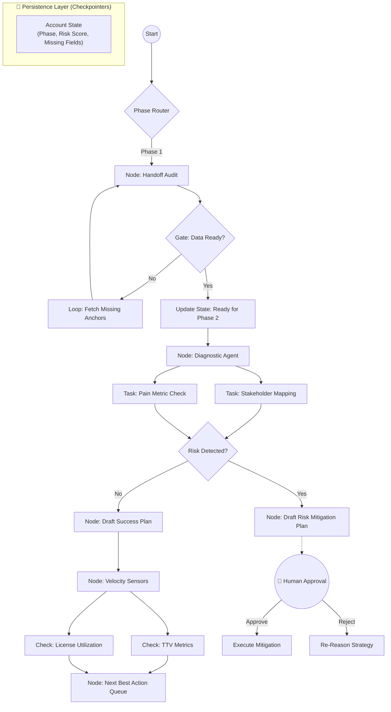

# Value-in-Motion™: Autonomous AI Agent for Customer Success Manager
[]() []() []() []() []() []()

# I. Executive Overview

## What It Is

**Value-in-Motion™** is an event-driven, stateful autonomous AI agent that executes the full Customer Success lifecycle:

**Sales Handoff → Onboarding → Adoption → Risk Management → Renewal → Expansion**

It transforms Customer Success from reactive relationship management into a structured, signal-driven revenue engine.


## What Makes It Different

Most automation tools:
- Trigger linear workflows
- Fire isolated tasks
- Depend heavily on human orchestration

Value in Motion™:
- Maintains persistent account state
- Uses graph-based reasoning
- Gates progress based on data readiness
- Loops until success criteria are met
- Acts — not just suggests

**Human = supervisor**

**Agent = lifecycle executor**


# II. Philosophy: Lean Customer Success Flow

Customer Success waste leads to churn.

We apply Lean (Muda, Mura, Muri) directly to SaaS telemetry.

| Lean Concept             | SaaS Equivalent                     | Agentic Response                                   |
| ------------------------ | ----------------------------------- | -------------------------------------------------- |
| **Muda (Waste)**         | Shelfware / unused licenses         | Auto-audit + License Optimization Plan             |
| **Mura (Inconsistency)** | Erratic adoption patterns           | Usage gap detection + Targeted enablement workflow |
| **Muri (Overburden)**    | Ticket spikes / escalation overload | Risk correlation + Pre-renewal alert               |

The agent continuously scans telemetry to detect structural inefficiencies before revenue impact.


# III. Domain Logic: The Lifecycle Map

The agent does not hallucinate arbitrary actions.

It operates against a **strict lifecycle state** machine, where each phase has:
- Required anchors
- Gated transitions
- Exit criteria
- Escalation logic
  
## Customer Success Lifecycle Phases (MVP)
**1. Handoff Audit**
- Validate contract & opportunity data
- Identify missing anchors
- Detect expectation gaps

**2. Diagnostic Phase**
- Stakeholder mapping
- Pain metric validation
- Risk detection

**3. Success Plan Construction**
- 30-60-90 roadmap
- KPI alignment
- Value hypothesis

**4. Velocity Monitoring**
- TTV metrics
- License utilization
- Engagement signals
- Next Best Action queue

**5. Pre-Renewal Orchestration**
- Risk scoring
- Expansion detection
- Renewal brief generation

# IV. Technical Architecture

## Stateful Orchestration Engine
This system moves beyond simple:

Trigger → Action automation.

It implements a **LangGraph-based state machine** where:
- Each account has persistent state
- The agent reasons across days/weeks
- Progression is gated
- Loops resolve missing data
- Human approval can be injected

## Architecture Layers

**1. Experience Layer**
- Slack
- Email
- CRM (Salesforce / Planhat)

**2. Agent Runtime Layer (LangGraph)**
- Phase router
- Conditional gates
- Loop resolution
- Risk branching

**3. Persistence Layer**
- Account state (Phase, Risk Score, Missing Anchors)
- Checkpointers

**4. Observability Layer (LangSmith)**
- Execution traces
- Hallucination detection
- Token cost tracking
- Regression testing

## Agentic Layers


## Orchestration Flow



## Stateful Orchestration

This system moves beyond simple "Trigger -> Action" automation. It uses LangGraph to implement a State Machine. The agent has a "Long-Term Memory" (State) for each account and persists context across days or weeks.

**Architecture Layers**:
1. **Experience Layer**: Human interaction via Slack, Email, and CRM (Salesforce/Planhat).
2. **Agent Layer** (LangGraph): The runtime brain. Handles branching, loops, and "Human-in-the-loop" gates.
3. **Engineering Layer** (LangSmith): Control plane for tracing execution, debugging agent reasoning, and running regression tests.



## Tech Stack (MVP)

- **Orchestration**: LangGraph (Python)
- **LLM**: Claude 3.5 Sonnet / GPT-4o
- **Framework**: LangChain
- **Observability**: LangSmith
- **Data Sources**: Salesforce / Planhat / Snowflake
- **Telemetry Analysi**s: Pandas / SQL

No multi-agent swarm.
No heavy ML forecasting.
Focused lifecycle execution.


# VI. Repository Structure

```css
value-in-motion-agent/
├── src/
│   ├── graph/
│   │   ├── __init__.py
│   │   ├── state.py           # Defines the AccountState (TypedDict)
│   │   ├── nodes.py           # Core logic (Audit Node, Diagnostic Node)
│   │   ├── edges.py           # Conditional logic (Gates and Routers)
│   │   └── compiled_graph.py  # The LangGraph entry point
│   ├── tools/
│   │   ├── crm_tools.py       # Salesforce/HubSpot connectors
│   │   ├── email_tools.py     # Draft generation
│   │   └── data_tools.py      # Telemetry analysis (Pandas/SQL)
│   └── prompts/
│       ├── auditor_prompt.yaml
│       └── strategist_prompt.yaml
├── tests/
│   ├── unit/                  # Function tests
│   └── integration/           # Full graph run tests
├── docs/
│   ├── architecture.mmd
│   └── setup_guide.md
├── requirements.txt
└── .env.example
```

Structured for:
- Unit testing
- Integration testing
- Eval-driven development
- CI/CD compatibility


# V. Observability & Evals

The agent is treated as production software.

**Core Metrics**
1. Handoff audit accuracy
2. False-positive risk detection
3. Draft safety compliance
4. Token cost per account
5. Time saved per lifecycle phase

Every execution is traceable and regression-tested in LangSmith.

# VIII. MVP Definition

This is not a CRM replacement.

This is an autonomous lifecycle execution engine.

The MVP succeeds if:
- ≥30% time saved per CSM
- No dropped stakeholder
- Renewal brief generated ≥80% relevance
- Expansion signals surfaced early
- Lean waste auto-detected


# IX. Proof of Concept

**The Agentic Audit**

In a Tier-1 deployment:
- 75% unused license capacity identified (Muda)
- ~$45,000/year inefficiency detected
- Renewal conversation reframed 6 months early
- Shift from downsell risk → redeployment strategy

# X. Installation

```bash
git clone https://github.com/ValueInMotion/value-in-motion-agent.git
cd value-in-motion-agent
pip install -r requirements.txt
cp .env.example .env
```

Add API keys:
- Anthropic / OpenAI
- LangSmith
- CRM credentials

# XI. Vision

Customer Success today:
- Manual
- Reactive
- Fragmented
- Signal-blind

Value in Motion™:
- Structured
- Stateful
- Signal-driven
- Autonomous
- Expansion-oriented

From relationship management
**→ To autonomous revenue orchestration.**
