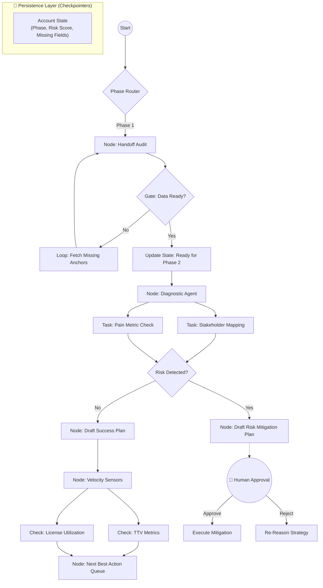
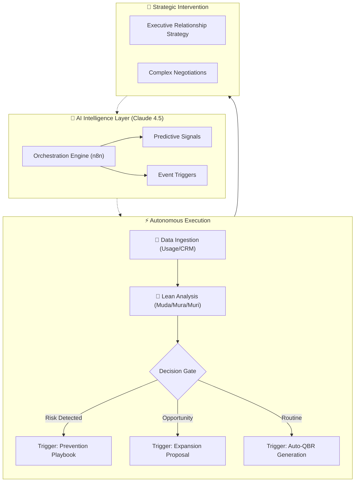
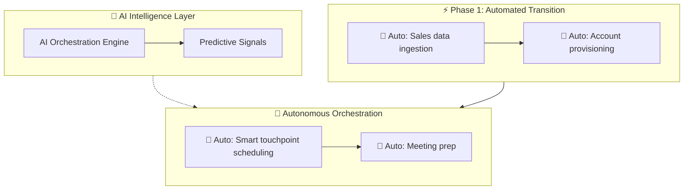
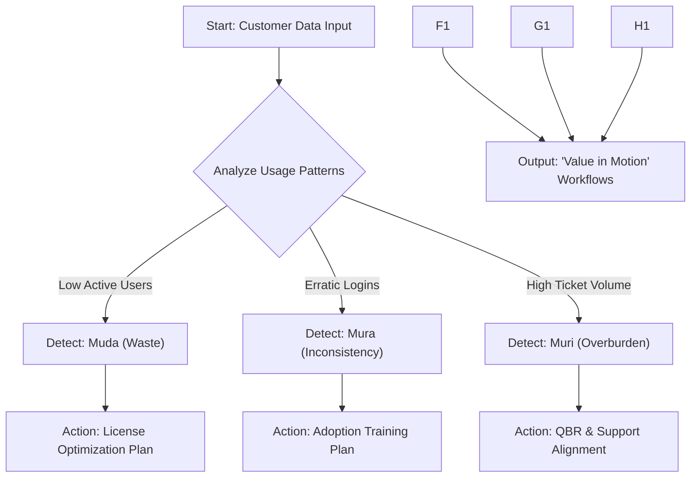
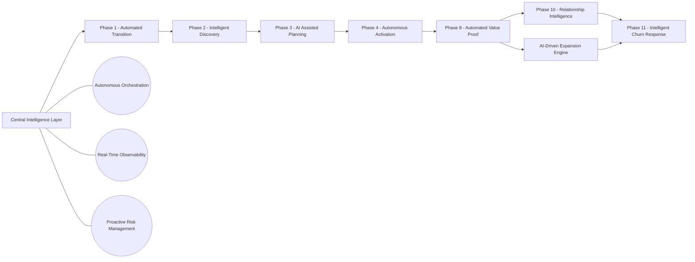

# Value-in-Motion™: The Agentic Customer Success Operating System
[]() []() []() []() []() []()

# I. High-Level Vision (The "Why")

## 1. Value-in-Motion™: The Agentic Customer Success Operating System
**Value-in-Motion™** is an event-driven, autonomous architecture that transforms Customer Success from a reactive support function into a scalable revenue engine.

Unlike traditional "human-in-the-loop" automation (which simply fires linear tasks), this system utilizes **Autonomous Agentic Orchestration** (Stateful Graphs). It maintains the "state" of every customer account, actively reasoning through risks, gating progress based on data readiness, and looping until success criteria are met.

---

## 2. The Philosophy: Lean Customer Success Flow of Work
We apply **Lean Principles** to SaaS telemetry to identify "waste" Muda before it becomes churn.

| Lean Principle | In SaaS Terms | The Agentic Response |
| :--- | :--- | :--- |
| **Muda (Waste)** | Paying for unused licenses or features. | **Auto-Audit:** Agent identifies shelfware and drafts a "License Optimization Plan" to save the renewal. |
| **Mura (Inconsistency)** | Erratic login patterns or "spiky" adoption. | **Auto-Nudge:** Agent detects usage gaps and triggers targeted training workflows. |
| **Muri (Overburden)** | High volume of support tickets/complaints. | **Auto-Escalate:** Agent correlates ticket spikes with renewal dates and alerts the Director of CS. |
---

# II. Domain Logic (The "Map")

## 3. Customer Success Management Lifecycle
The agent operates against a strict map of the customer journey. It does not "hallucinate" random actions; it executes the specific requirements of each phase defined in the state machine.

```mermaid
flowchart LR
    %% MAIN LINEAR PHASES
    P1["1. Transition"] --> P2["2. Discovery"] --> P3["3. Alignment"] --> P4["4. Activation"] --> P8["8. Value Proof"] --> P10["10. Advocacy"]

    %% OPERATIONAL LOOP
    P5["5. Operational Orchestration"]
    P6["6. Observability"]
    P7["7. Risk Control"]

    P4 --> P5 --> P6 --> P7 --> P5
    
    %% RISK PATH
    RD{"Risk Detected?"}
    P7 --> RD
    RD -->|Yes| P11["11. Churn Handling"]
    RD -->|No| P5
 ```   
  
(Refer to docs/csm_activities_map.mmd for the full 44-step detailed activity breakdown)

# III. Technical Architecture (The "Engine")

## 4. Customer Success Stateful Orchestration

This system moves beyond simple "Trigger -> Action" automation. It uses LangGraph to implement a State Machine. The agent has a "Long-Term Memory" (State) for each account and persists context across days or weeks.

```mermaid
graph LR
    %% Main Sequential Phases
    P1["Phase 1: Transition<br/>────────────<br/>1. Sales handoff<br/>2. Account activation<br/>3. Commercial awareness"]
    
    P2["Phase 2: Discovery & Assessment<br/>────────────<br/>4. Alignment questionnaire<br/>5. Maturity assessment<br/>6. Use-case discovery"]
    
    P3["Phase 3: Executive Alignment & CS Plan<br/>────────────<br/>8. Internal review<br/>9. Kickoff & stakeholder mapping<br/>10. Mutual expectations<br/>11. CS plan co-creation"]
    
    P4["Phase 4: Value Activation<br/>────────────<br/>12. Onboarding<br/>13. Training<br/>14. Education<br/>15. FTTV<br/>16. Workflow embedding<br/>17. TTV acceleration<br/>18. Adoption campaigns<br/>19. New features intro<br/>20. Playbook execution"]
    
    P8["Phase 8: Value Proof<br/>────────────<br/>33. Presentation<br/>34. QBR<br/>35. Executive storytelling<br/>36. Value realization<br/>37. Value quantification"]
    
    P10["Phase 10: Relationship Capital<br/>────────────<br/>42. Advocacy<br/>43. References<br/>44. Product feedback loop"]
    
    %% Continuous Processes
    OPS["Phase 5: Operational Orchestration<br/>────────────<br/>21. Touchpoints<br/>22. Meeting prep & follow-ups<br/>23. Emails and Chasing<br/>24. Documentation and CRM<br/>25. Internal alignment<br/>26. Partner and SI coordination"]
    
    OBS["Phase 6: Observability & Signals<br/>────────────<br/>27. Usage and Metrics review<br/>28. Telemetry, active users<br/>29. Health monitoring<br/>30. Feedback and VoC"]
    
    RISK["Phase 7: Risk Control<br/>────────────<br/>31. Risk prevention<br/>32. Risk playbooks<br/>33. Support & escalation"]
    
    %% Exception Handling
    DETECT{"Risk<br/>Detected?"}
    P11["Phase 11: Churn Handling<br/>────────────<br/>45. Churn save<br/>46. Post-mortem"]
    
    %% Main Flow
    P1 --> P2
    P2 --> P3
    P3 --> P4
    P4 --> P8
    P8 --> P10
    
    %% Continuous Process Interactions
    P3 -.-> OBS
    P4 --> OBS
    
    OBS <--> OPS
    OBS <--> RISK
    OPS <--> RISK
    
    %% Risk Detection Flow
    RISK --> DETECT
    DETECT -->|Yes| P11
    DETECT -.->|No| OBS
    
    %% Styling
    classDef transition fill:#FF9966,stroke:#333,stroke-width:2px,color:#000
    classDef discovery fill:#4A90D9,stroke:#333,stroke-width:2px,color:#fff
    classDef alignment fill:#339999,stroke:#333,stroke-width:2px,color:#fff
    classDef activation fill:#669966,stroke:#333,stroke-width:2px,color:#fff
    classDef proof fill:#669966,stroke:#333,stroke-width:2px,color:#fff
    classDef relationship fill:#5A7FA6,stroke:#333,stroke-width:2px,color:#fff
    classDef operational fill:#FF9966,stroke:#333,stroke-width:2px,color:#000
    classDef observability fill:#4A90D9,stroke:#333,stroke-width:2px,color:#fff
    classDef risk fill:#CC4444,stroke:#333,stroke-width:2px,color:#fff
    classDef churn fill:#E6E6E6,stroke:#333,stroke-width:2px,color:#000
    classDef decision fill:#CC4444,stroke:#333,stroke-width:3px,color:#fff
    
    class P1 transition
    class P2 discovery
    class P3 alignment
    class P4 activation
    class P8 proof
    class P10 relationship
    class OPS operational
    class OBS observability
    class RISK risk
    class P11 churn
    class DETECT decision
```

# Architecture Layers

1. **Experience Layer**: Human interaction via Slack, Email, and CRM (Salesforce/Planhat).
2. **Agent Layer** (LangGraph): The runtime brain. Handles branching, loops, and "Human-in-the-loop" gates.
3. **Engineering Layer** (LangSmith): Control plane for tracing execution, debugging agent reasoning, and running regression tests.



## 5. Tech Stack
- **Orchestration**: LangGraph (Python) - Replaces rigid n8n workflows with cyclic graphs.
- **LLM**: Claude 3.5 Sonnet / GPT-4o - Powered by LangChain.
- **Observability**: LangSmith - For tracing agent thought processes and calculating token costs per account.
- **Data Source**: Salesforce / Planhat / Snowflake.)

# IV. Repository Structure
The repository is structured to support enterprise-grade software engineering practices (Unit Testing, Evals, CI/CD).

value-in-motion-agent/
├── src/
│   ├── graph/
│   │   ├── __init__.py
│   │   ├── state.py           # Defines the AccountState (TypedDict)
│   │   ├── nodes.py           # Core logic (Audit Node, Diagnostic Node)
│   │   ├── edges.py           # Conditional logic (Gates and Routers)
│   │   └── compiled_graph.py  # The LangGraph entry point
│   ├── tools/
│   │   ├── crm_tools.py       # Salesforce/HubSpot connectors
│   │   ├── email_tools.py     # Draft generation
│   │   └── data_tools.py      # Telemetry analysis (Pandas/SQL)
│   └── prompts/
│       ├── auditor_prompt.yaml
│       └── strategist_prompt.yaml
├── tests/
│   ├── unit/                  # Function tests
│   └── integration/           # Full graph run tests
├── docs/
│   ├── architecture.mmd
│   └── setup_guide.md
├── requirements.txt
└── .env.example

# V. Observability & Evals (LangSmith)
We treat the agent as a product. Every run is traced in LangSmith to ensure reliability.

## Key Metrics Monitored:
1. **Handoff Audit Accuracy**: Did the agent correctly identify missing contract fields?
2. **Risk hallucination**: Did the agent flag a risk that didn't exist? (Regression testing).
3. **Draft Safety**: Ensures no email drafts contain unauthorized pricing commitments.

## 6. System Architecture
- Purpose: Use the Mermaid diagrams here. Show the "Autonomous Loops" and how data flows through the Intelligence Layer.
  The system moves beyond manual touchpoints into autonomous loops.

  Interaction Logic
- ## Explore the Interactive Workflow Logic (Claude Artifact)
  https://claude.ai/public/artifacts/f8b3874b-521a-4a13-a8c0-aa0e68f6463b
- ## Get embed code
  <iframe src="https://claude.site/public/artifacts/f8b3874b-521a-4a13-a8c0-aa0e68f6463b/embed" title="Claude Artifact" width="100%" height="600" frameborder="0" allow="clipboard-write" allowfullscreen></iframe>



- View Full Interaction Logic > Click above to explore the interactive Claude Artifact demonstrating the comprehensive workflow.
  https://claude.site/public/artifacts/6327c6cb-62f8-4b6c-a007-3dd07bbd6681/embed
  <details> <summary>📂 Click to view the Full Mermaid Source Code</summary>
  


(Note: Full expansive code is available in agentic_cs_workflow.mmd)
</details>

## 7. Claude Agentic Customer Success Operations — AI-Augmented Lifecycle
- Purpose: A deep dive into how the specific AI agent handles the logic within the architecture.

  Link (GitHub won't render iframes):
  https://github.com/ValueInMotion/value-in-motion-agent/blob/main/agentic_cs_workflow.mmd
- ## Implementation
  https://github.com/ValueInMotion/value-in-motion-agent/blob/main/agentic_cs_implementation_guide.md
- ## Guide
- https://github.com/ValueInMotion/value-in-motion-agent/blob/main/agentic_cs_framework_guide.md


# IV. Proof of Concept & Use Cases

## 8. Value-in-Motion-Agent (The Auditor)
- Purpose: Introduce the specific tool included in this repo. This is your primary "Product" or "Feature."
  
An agentic Customer Success auditor that identifies Lean waste (Muda, Mura, Muri) and automates strategic account health reviews
Value in Motion™: Agentic CS Audit Framework
This repository demonstrates the codification of my proprietary Customer Success methodology into an automated, AI-driven diagnostic engine.

- The Core Problem
  Traditional CS health scores are often static and reactive. This framework applies Lean principles (Muda, Mura, Muri) to telemetry data to identify hidden churn risks and expansion opportunities before they hit the dashboard.
- Technical Execution
  Workflow Engine: n8n (visual orchestrator).
- Intelligence Layer: Claude 4.5 Sonnet (using a custom System Prompt grounded in CS logic).
  Integrations: Google Sheets (Data Source) and Gmail (Automated Reporting).

Logic Blueprint


## 9. Real-World Impact: The "Agentic Audit"
- Purpose: The case study (e.g., the $45k waste identification). This proves the theory works.
  
In a recent deployment, the Value-in-Motion agent identified 75% Unused Capacity (Muda) for a Tier-1 account.
- Calculated Waste: ~$45,000/year.
- Outcome: The agent automatically drafted a "Value Realization Roadmap," allowing the CSM to pivot the conversation from a "downsell risk" to a "re-deployment strategy" 6 months before the renewal date.


# V. Developer Resources (The "Action")

## 10. Repository Structure
- Purpose: A directory of files (/workflows, /prompts) so users can navigate the repo.

- /workflows: Exported n8n JSON blueprints.
- /prompts: System prompts for the Claude-based Reasoning Engine.
- agentic_cs_workflow.mmd: Full Mermaid source code for the lifecycle diagram.

## 11. Agentic Customer Success Operations — Intelligence
- Purpose: Links to your implementation_guide.md and framework_guide.md.
  


## 12. License
- Purpose: Legal boilerplate (MIT).

  Distributed under the MIT License. See LICENSE for more information.

```mermaid
graph TB
    subgraph Phase1["Phase 1 - Transition"]
        A1["1. Sales handoff"]
        A2["2. Account activation"]
        A3["3. Commercial awareness"]
    end
    
    subgraph Phase2["Phase 2 - Discovery & Assessment"]
        B1["4. Alignment questionnaire"]
        B2["5. Maturity assessment"]
        B3["6. Use-case discovery"]
    end
    
    subgraph Phase3["Phase 3 - Executive Alignment & CS Plan"]
        C1["8. Internal review"]
        C2["9. Kickoff & stakeholder mapping"]
        C3["10. Mutual expectations"]
        C4["11. CS plan co-creation"]
    end
    
    subgraph Phase4["Phase 4 - Value Activation"]
        D1["12. Onboarding"]
        D2["13. Training"]
        D3["14. Education"]
        D4["15. FTTV"]
        D5["16. Workflow embedding"]
        D6["17. TTV acceleration"]
        D7["18. Adoption campaigns"]
        D8["19. New features intro"]
        D9["20. Playbook execution"]
    end
    
    subgraph Phase8["Phase 8 - Value Proof"]
        E1["33. Presentation (insight sharing)"]
        E2["34. QBR (formal value review)"]
        E3["35. Executive storytelling (business narrative)"]
        E4["36. Value realization (outcomes shown)"]
        E5["37. Value quantification (ROI / RoSI)"]
    end
    
    subgraph Phase10["Phase 10 - Relationship Capital"]
        F1["42. Advocacy"]
        F2["43. References"]
        F3["44. Product feedback loop"]
    end
    
    subgraph Operational["Phase 5 - Operational Orchestration ∞"]
        G1["21. Touchpoints (regular interactions)"]
        G2["22. Meeting Preparation & Follow-ups (drive actions)"]
        G3["23. Emails / Chasing (follow-through)"]
        G4["24. Documentation / CRM hygiene (systems of record)"]
        G5["25. Internal Alignment (sync internal teams)"]
        G6["26. Partner / SI coordination (ecosystem work)"]
    end
    
    subgraph Observability["Phase 6 - Observability & Signals ∞"]
        H1["27. Usage / Metrics Review"]
        H2["22. Telemetry, active users, frequency"]
        H3["28. Health Monitoring (status indicators)"]
        H4["29. Feedback / VoC (customer voice)"]
    end
    
    subgraph Risk["Phase 7 - Risk Control ∞"]
        I1["30. Risk Prevention (anticipation, early signals)"]
        I2["31. Risk playbooks (standard responses)"]
        I3["32. Support & Escalation (issue resolution)"]
    end
    
    subgraph Phase11["Phase 11 - Churn Handling (exception)"]
        J1["45. Churn save"]
        J2["46. Post-mortem"]
    end
    
    RiskDetected["Risk Detected"]
    
    Phase1 --> Phase2
    Phase2 --> Phase3
    Phase3 --> Phase4
    Phase4 --> Phase8
    Phase8 --> Phase10
    
    Phase3 -.-> Observability
    Phase4 --> Observability
    
    Observability <--> Operational
    Observability <--> Risk
    Operational <--> Risk
    
    Risk -.-> RiskDetected
    RiskDetected -.-> Phase11
    
    style Phase1 fill:#ff9966
    style Phase2 fill:#4a90d9
    style Phase3 fill:#339999
    style Phase4 fill:#669966
    style Phase8 fill:#669966
    style Phase10 fill:#5a7fa6
    style Operational fill:#ff9966
    style Observability fill:#4a90d9
    style Risk fill:#cc4444
    style Phase11 fill:#e6e6e6
    style RiskDetected fill:#cc4444
```




