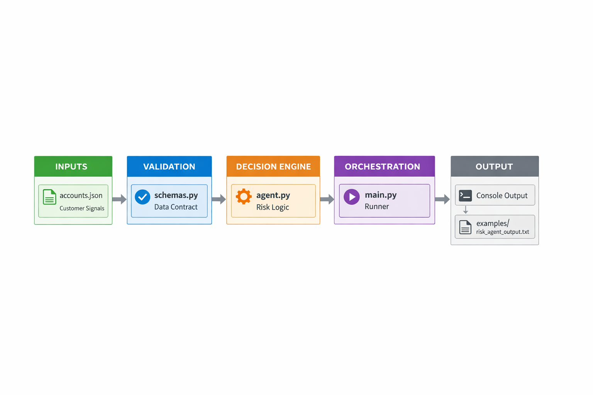
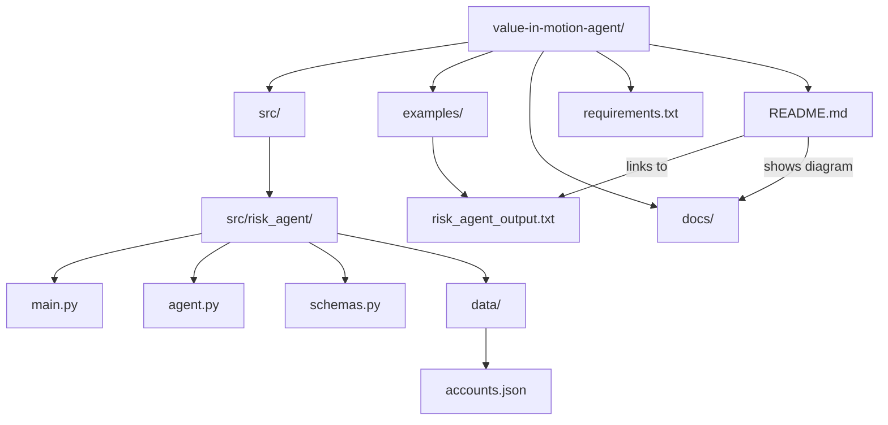

# Value-in-Motion™ — Autonomous Lifecycle Engine
[]() 
[]() 
[]() 
[]() 
[]() 
[]()

---

# 1. What It Is

**An autonomous, lifecycle-aware AI Revenue Operating System for Customer Success.**

Value in Motion™ detects **value friction**, anticipates **risk from day one**, and **orchestrates targeted actions** across the entire customer lifecycle.

It operates in closed loops:

**Detect → Diagnose → Decide → Act → Observe → Improve**

> Not a dashboard.  
> Not a chatbot.  
> A lifecycle decision and execution engine.  

---

# 2. Why It Matters

Customer Success does not fail due to a lack of data.
It fails due to a lack of structured execution.

Most CS teams:
- Track health scores
- React to churn signals
- Coordinate manually across tools

Value in Motion™ transforms Customer Success from reactive tracking to **proactive revenue orchestration**.

---

# 3. Who It Is For

- **Customer Success Leaders (CSM / CS Ops)** scaling retention and operational rigor
- **Series A–C SaaS Founders** building predictable revenue engines
- **Revenue & GTM teams** focused on NRR and expansion
- **AI / Agentic builders** designing autonomous SaaS workflows

---

# 4. Expected Impact

- **-+20–40% Net Revenue Retention uplift**
- **–30% manual CSM workload**
- **30–90 days earlier renewal risk detection**
- **Stronger expansion signal visibility**
- **Structured lifecycle governance**

---

# 5. Current Scope (What works today)

- ✅ Risk Detection Agent (Sales → Adoption → Renewal)
- ✅ Lifecycle-based phase scoring logic
- ✅ Phase-level diagnostic output (identify broken stage)
- ✅ Actionable recommendations
- ✅ Local execution engine (Python)

## In Progress

- ⏳ Multi-agent lifecycle orchestration (LangGraph full loop)
- ⏳ CRM + telemetry integration
- ⏳ LLM-powered reasoning layer
- ⏳ Autonomous execution tools (email, CRM updates, alerts)

---

# 6. Strategic Positioning

Value in Motion™ is not a chatbot.
It is a **Revenue Operating System** ensuring value flows continuously from:

**Intent → Outcomes → Adoption → Impact → ROI → Expansion → Reinvestment → Renewal**

When value flows, revenue follows.

---

# 7. Live Demo — risk_detection_agent (V0)

A runnable lifecycle-aware agent detecting churn risk across:

**Sales → Adoption → Renewal**

Run locally:
pip install -r requirements.txt
python -m src.risk_agent.main

## System Flow — Risk Detection Agent


### #1. INPUTS — Signals Enter the System

**Source**
- `examples/sample_account.json`
- (future: CRM, telemetry, product usage)

**Signals**
- ICP fit
- Usage metrics
- Stakeholders
- Deal complexity
- ROI signals

&rarr; Raw customer reality.


### #2. VALIDATION — Structured Input

**File:** `schemas.py`

- Pydantic validation
- Data standardization
- Garbage-in protection

&rarr; Turns signals into a trusted state.


### #3. DECISION ENGINE — Lifecycle Diagnosis

**File:** `agent.py`

- Risk scoring (LOW / MEDIUM / HIGH)
- Root cause detection
- Phase break mapping
- Recommended corrective motion

&rarr; This is the deterministic lifecycle brain &rarr;  probabilistic AI


### #4. ORCHESTRATION — Execution Runtime

**File:** `main.py`

- Load signals
- Invoke agent
- Output structured decision

&rarr; Orcchestrate Value-in-Motion™ framework


### #5. OUTPUT — Decision-Ready Insight

=== VALUE IN MOTION — RISK AGENT ===

Account: ACME
Risk: HIGH
Reasons: Low ICP fit, High deal complexity, Low usage (30d), No workflow integration, No executive engagement
Action: Recovery: exec alignment + value proof plan (14 days)

&rarr; Not analytics.  
&rarr; Actionable motion. 
 
---

# 8. Core Architecture

```mermaid
flowchart TB
  A[Signals] --> B[Validation Layer]
  B --> C[Lifecycle Diagnosis Engine]
  C --> D[Phase Break Detection]
  D --> E[Corrective Motion Recommendation]
  E --> F[Execution Layer]
  F --> G[Observation Loop]
  G --> C
  ```

# 9. Lifecycle Model

The agent operates against a strict lifecycle state machine:

**Intent → Outcomes → Workflow → Operational Change → Adoption → Usage → Impact → Value → Expansion → Executive Validation → Reinvestment**

Risk = friction in one of these phases.

> High Risk ≠ churn prediction.  
> High Risk = broken value flow.

---

# 10. Lean Philosophy — Zero Waste CS

> Applying Lean (Muda, Mura, Muri) to SaaS telemetry:  

| Lean Concept         | SaaS Reality      | Agent Response               |
| -------------------- | ----------------- | ---------------------------- |
| Muda (Waste)         | Shelfware         | License optimization plan    |
| Mura (Inconsistency) | Adoption gaps     | Targeted enablement workflow |
| Muri (Overload)      | Escalation spikes | Pre-renewal mitigation       |

> The agent scans continuously for structural inefficiency before revenue impact.  

---

# 11. Technical Stack (MVP)

- **Orchestration:** LangGraph
- **LLM Layer:** Claude / GPT
- **Framework:** LangChain
- **Observability:** LangSmith
- **Telemetry:** Pandas / SQL
- **Execution Layer:** Python runtime

Structured for:  
- Unit testing
- Integration testing
- Eval-driven development
- CI/CD readiness

---

# 12. What Makes It Different

- Most automation:
- Linear workflows
- Static triggers
- Human-dependent orchestration

Value-in-Motion™:
- Stateful lifecycle reasoning
- Persistent account memory
- Gated phase transitions
- Loop resolution until criteria met
- Human-in-the-loop governance

Human = Supervisor
Agent = Lifecycle Executor

---

# 13. MVP Success Criteria

- ≥30% time saved per CSM
- Renewal brief auto-generated with ≥80% relevance
- Expansion surfaced before renewal window
- Lean waste auto-detected
- No dropped stakeholder

---

# 14. Vision

Customer Success today:
- Reactive
- Fragmented
- Signal-blind

Value-in-Motion™:
- Structured
- Stateful
- Signal-driven
- Autonomous
- Expansion-oriented

From relationship management  
→ To autonomous revenue orchestration.

---

# 15. Positioning

Value-in-Motion™ is not:
- a CRM
- a dashboard
- a reporting tool

It is:

→  An Autonomous Customer Success Operating System

---

---


# Value-in-Motion™Architecture Layers

** #1. Experience Layer**
- Slack
- Email
- CRM (Salesforce / Planhat)

** #2. Agent Runtime Layer (LangGraph)**
- Phase router
- Conditional gates
- Loop resolution
- Risk branching

** #3. Persistence Layer**
- Account state (Phase, Risk Score, Missing Anchors)
- Checkpointers

** #4. Observability Layer (LangSmith)**
- Execution traces
- Hallucination detection
- Token cost tracking
- Regression testing

## Agentic Layers:

**Layer 1: Engine**
- Orchestration
- Planning

**Layer 2: Policy**
- Governance
- Runtime 

**Layer 3: Multi-Agents**
- risk_agent
- onboarding_agent
- workflow_integration_agent
- value_velocity_agent
- qbr_agent
- predictive_customer_profile_agent
- expansion_agent
- renewal_agent


## Stateful Orchestration

This system moves beyond simple "Trigger -> Action" automation. It uses LangGraph to implement a State Machine. The agent has a "Long-Term Memory" (State) for each account and persists context across days or weeks.

**Architecture Layers**:
1. **Experience Layer**: Human interaction via Slack, Email, and CRM (Salesforce/Planhat).
2. **Agent Layer** (LangGraph): The runtime brain. Handles branching, loops, and "Human-in-the-loop" gates.
3. **Engineering Layer** (LangSmith): Control plane for tracing execution, debugging agent reasoning, and running regression tests.

```mermaid
flowchart TB
    subgraph Memory ["💾 Persistence Layer (Checkpointers)"]
        State["Account State<br/>(Phase, Risk Score, Missing Fields)"]
    end

    Start((Start)) --> Router{Phase Router}

    %% PHASE 1: TRANSITION
    Router -->|Phase 1| P1[Node: Handoff Audit]
    P1 --> G1{Gate: Data Ready?}
    G1 -- No --> L1[Loop: Fetch Missing Anchors]
    L1 --> P1
    G1 -- Yes --> P1_Exit[Update State: Ready for Phase 2]

    %% PHASE 2: DIAGNOSTIC
    P1_Exit --> P2[Node: Diagnostic Agent]
    P2 --> Q1[Task: Stakeholder Mapping]
    P2 --> Q2[Task: Pain Metric Check]
    Q1 & Q2 --> Risk{Risk Detected?}
    
    Risk -- Yes --> Escalate[Node: Draft Risk Mitigation Plan]
    Risk -- No --> CSP[Node: Draft Success Plan]

    %% PHASE 4: VELOCITY
    CSP --> P4[Node: Velocity Sensors]
    P4 --> S1[Check: TTV Metrics]
    P4 --> S2[Check: License Utilization]
    
    S1 & S2 --> NBA[Node: Next Best Action Queue]
    
    %% HUMAN INTERVENTION
    Escalate -.-> Human((👤 Human Approval))
    Human -->|Approve| Action[Execute Mitigation]
    Human -->|Reject| Replan[Re-Reason Strategy]
```

## Tech Stack (MVP)

- **Orchestration**: LangGraph (Python)
- **LLM**: Claude 3.5 Sonnet / GPT-4o
- **Framework**: LangChain
- **Observability**: LangSmith
- **Data Sources**: Salesforce / Planhat / Snowflake
- **Telemetry Analysis**: Pandas / SQL

No multi-agent swarm.
No heavy ML forecasting.
Focused lifecycle execution.

---

# 9. Repository Structure

```css
value-in-motion-agent/
├── src/
│   ├── graph/
│   │   ├── __init__.py
│   │   ├── state.py           # Defines the AccountState (TypedDict)
│   │   ├── nodes.py           # Core logic (Audit Node, Diagnostic Node)
│   │   ├── edges.py           # Conditional logic (Gates and Routers)
│   │   └── compiled_graph.py  # The LangGraph entry point
│   ├── tools/
│   │   ├── crm_tools.py       # Salesforce/HubSpot connectors
│   │   ├── email_tools.py     # Draft generation
│   │   └── data_tools.py      # Telemetry analysis (Pandas/SQL)
│   └── prompts/
│       ├── auditor_prompt.yaml
│       └── strategist_prompt.yaml
├── tests/
│   ├── unit/                  # Function tests
│   └── integration/           # Full graph run tests
├── docs/
│   ├── architecture.mmd
│   └── setup_guide.md
├── requirements.txt
└── .env.example
```

Structured for:
- Unit testing
- Integration testing
- Eval-driven development
- CI/CD compatibility


### Use Case Repository Flow Chart



---

# 10. Observability & Evals

The agent is treated as production software.

**Core Metrics**
1. Handoff audit accuracy
2. False-positive risk detection
3. Draft safety compliance
4. Token cost per account
5. Time saved per lifecycle phase

Every execution is traceable and regression-tested in LangSmith.

---

# 11. Installation

```bash
git clone https://github.com/ValueInMotion/value-in-motion-agent.git
cd value-in-motion-agent
pip install -r requirements.txt
cp .env.example .env
```

Add API keys:
- Anthropic / OpenAI
- LangSmith
- CRM credentials

---
