```mermaid
flowchart TB
  %% INTELLIGENCE LAYER
  subgraph INTEL["🧠 AI Intelligence Layer (Claude 4.5)"]
    direction LR
    ai_engine["Orchestration Engine (n8n)"] --> ai_signals["Predictive Signals"]
    ai_engine --> ai_triggers["Event Triggers"]
  end
  
  %% AUTOMATED PHASES
  subgraph AUTO["⚡ Autonomous Execution"]
    direction TB
    a1["🤖 Data Ingestion (Usage/CRM)"] --> a2["🤖 Lean Analysis (Muda/Mura/Muri)"]
    a2 --> a3{Decision Gate}
    
    a3 -- Risk Detected --> a4["Trigger: Prevention Playbook"]
    a3 -- Opportunity --> a5["Trigger: Expansion Proposal"]
    a3 -- Routine --> a6["Trigger: Auto-QBR Generation"]
  end

  %% HUMAN LAYER
  subgraph HUMAN["👤 Strategic Intervention"]
    h1["Executive Relationship Strategy"]
    h2["Complex Negotiations"]
  end
  
  INTEL -.-> AUTO
  AUTO --> HUMAN
  HUMAN -.-> INTEL
```

# Value-in-Motion™: The Agentic CS Operating System

[]() []() []()

**Value-in-Motion™** is an event-driven, AI-augmented architecture that transforms Customer Success from a reactive support function into a scalable revenue engine. It operationalizes the "Agentic CS" model to automate **80% of administrative overhead** while driving Net Revenue Retention (NRR).

---

## The Core Logic: Engineering Revenue

Traditional Health Scores are lagging indicators. This framework treats Customer Success as an engineering problem, applying **Lean Manufacturing Principles** to SaaS telemetry data to detect risks before they appear on a dashboard.

| Lean Principle | In SaaS Terms | The Agentic Response |
| :--- | :--- | :--- |
| **Muda (Waste)** | Paying for unused licenses or features. | **Auto-Audit:** Agent identifies shelfware and drafts a "License Optimization Plan" to save the renewal. |
| **Mura (Inconsistency)** | Erratic login patterns or "spiky" adoption. | **Auto-Nudge:** Agent detects usage gaps and triggers targeted training workflows. |
| **Muri (Overburden)** | High volume of support tickets/complaints. | **Auto-Escalate:** Agent correlates ticket spikes with renewal dates and alerts the Director of CS. |
---

## System Architecture

This diagram represents the "Source Code" of the Agentic CS lifecycle—moving from manual touchpoints to autonomous loops.


View Full Interaction Logic > Click above to explore the interactive Claude Artifact demonstrating the comprehensive workflow.
https://claude.site/public/artifacts/6327c6cb-62f8-4b6c-a007-3dd07bbd6681/embed

<details> <summary>📂 Click to view the Full Mermaid Source Code</summary>
flowchart TB
  subgraph INTEL["🧠 AI Intelligence Layer"]
    direction LR
    ai_engine["AI Orchestration Engine"] --> ai_signals["Predictive Signals"]
  end
  subgraph AP1["⚡ Phase 1: Automated Transition"]
    a1_1["🤖 Auto: Sales data ingestion"] --> a1_2["🤖 Auto: Account provisioning"]
  end
  subgraph LOOP1["🔄 Autonomous Orchestration"]
    l1_1["🤖 Auto: Smart touchpoint scheduling"] --> l1_2["🤖 Auto: Meeting prep"]
  end
  INTEL -.-> LOOP1
  AP1 --> LOOP1
```
(Note: Full expansive code is available in agentic_cs_workflow.mmd)
</details>

## Tech Stack
This framework is built on a "Low-Code / High-Logic" stack designed for rapid deployment in enterprise environments.
Orchestration: n8n (Workflow Automation)
Intelligence: Claude 3.5 Sonnet (Reasoning & Narrative Generation)
Data Layer: Google Sheets / Snowflake (Telemetry Source)
Presentation: Gmail / Slack / Slides API (Automated Reporting)
  
## Value-in-Motion-agent
An agentic Customer Success auditor that identifies Lean waste (Muda, Mura, Muri) and automates strategic account health reviews
Value in Motion™: Agentic CS Audit Framework
This repository demonstrates the codification of my proprietary Customer Success methodology into an automated, AI-driven diagnostic engine.

The Core Problem
Traditional CS health scores are often static and reactive. This framework applies Lean principles (Muda, Mura, Muri) to telemetry data to identify hidden churn risks and expansion opportunities before they hit the dashboard.

Technical Execution
Workflow Engine: n8n (visual orchestrator).

Intelligence Layer: Claude 4.5 Sonnet (using a custom System Prompt grounded in CS logic).

Integrations: Google Sheets (Data Source) and Gmail (Automated Reporting).

Logic Blueprint

## Real-World Impact
The agent successfully identified 75% Unused Capacity (Muda) and calculated an estimated $45,000/year in waste, providing an immediate strategic pivot for the CSM.

## Customer Success Management Activities


## Customer Success Management Activities


## Claude Agentic Customer Success Operations — AI-Augmented Lifecycle

Link (GitHub won't render iframes):
https://github.com/ValueInMotion/value-in-motion-agent/blob/main/agentic_cs_workflow.mmd
## Implementation
https://github.com/ValueInMotion/value-in-motion-agent/blob/main/agentic_cs_implementation_guide.md
## Guide
https://github.com/ValueInMotion/value-in-motion-agent/blob/main/agentic_cs_framework_guide.md

## Agentic Customer Success Operations — Mermaid Flowchart


