# Value-in-Motion™: Autonomous Lifecycle Engine for Customer Success
[]() 
[]() 
[]() 
[]() 
[]() 
[]()

---

## What this is

An autonomous, lifecycle-aware AI system that **detects risk, orchestrates actions, and drives revenue outcomes across Customer Success.**
> This is not a dashboard. This is a **decision engine for Customer Success.**

## Who this is for

- Customer Success Leaders (CSM / CS Ops)
- SaaS Founders (Series A–C)
- Revenue / GTM teams focused on NRR & expansion
- AI / Agentic builders in SaaS workflows

## Expected Impact

- +20–40% improvement in Net Revenue Retention (NRR)
- -30% manual CSM workload
- Earlier risk detection (30–90 days ahead of renewal)
- Increased expansion signal visibility

## Current Scope (What works today)

- ✅ Risk Detection Agent (Sales → Adoption → Renewal)
- ✅ Lifecycle-based scoring logic
- ✅ Actionable recommendations
- ✅ Local execution (Python)

## In Progress

- ⏳ Multi-agent orchestration (LangGraph full lifecycle)
- ⏳ CRM + telemetry integration
- ⏳ LLM-based reasoning layer

## Proof

- End-to-end runnable agent (`src/risk_agent`)
- Deterministic lifecycle scoring model
- Structured output with explainability
- GitHub demo + reproducible results
  
---

## Live Demo — Risk Detection Agent (V0)

A working lifecycle-aware agent that detects churn risk across:

**Sales → Adoption → Renewal**

### Run locally

```bash
pip install pydantic
python -m src.risk_agent.main
```

### Example Output

**=== VALUE IN MOTION — RISK AGENT ===**

**Account: ACME**
**Risk: HIGH**

**Reasons:**
Low ICP fit, High deal complexity, Low usage (30d), No workflow integration, Low ROI, No executive engagement

**Action:**
Recovery: exec alignment + value proof plan (14 days)

**Full output:**
examples/risk_agent_output.txt
[examples/risk_agent_output.txt](https://github.com/ValueInMotion/value-in-motion-agent/blob/main/examples/risk_agent_output.txt)

---

# I. Executive Overview

## What It Is

**Value-in-Motion™** is an event-driven, stateful autonomous AI agent that executes the full Customer Success lifecycle:

**Sales Handoff → Onboarding → Adoption → Risk Management → Renewal → Expansion**

It transforms Customer Success from reactive relationship management into a structured, signal-driven revenue engine.


## What Makes It Different

Most automation tools:
- Trigger linear workflows
- Fire isolated tasks
- Depend heavily on human orchestration

Value in Motion™:
- Maintains persistent account state
- Uses graph-based reasoning
- Gates progress based on data readiness
- Loops until success criteria are met
- Acts — not just suggests

**Human = Supervisor**  
**↓**  
**Agent = Lifecycle Executor**


# II. Philosophy: Lean Customer Success Flow

Customer Success waste leads to churn.

We apply Lean (Muda, Mura, Muri) directly to SaaS telemetry.

| Lean Concept             | SaaS Equivalent                     | Agentic Response                                   |
| ------------------------ | ----------------------------------- | -------------------------------------------------- |
| **Muda (Waste)**         | Shelfware / unused licenses         | Auto-audit + License Optimization Plan             |
| **Mura (Inconsistency)** | Erratic adoption patterns           | Usage gap detection + Targeted enablement workflow |
| **Muri (Overburden)**    | Ticket spikes / escalation overload | Risk correlation + Pre-renewal alert               |

The agent continuously scans telemetry to detect structural inefficiencies before revenue impact.


# III. Domain Logic: The Lifecycle Map

The agent does not hallucinate arbitrary actions.

It operates against a **strict lifecycle state machine**, where each phase has:
- Required anchors
- Gated transitions
- Exit criteria
- Escalation logic
  
## Customer Success Lifecycle Phases (MVP)
**1. Handoff Audit**
- Validate contract & opportunity data
- Identify missing anchors
- Detect expectation gaps

**2. Diagnostic Phase**
- Stakeholder mapping
- Pain metric validation
- Risk detection

**3. Success Plan Construction**
- 30-60-90 roadmap
- KPI alignment
- Value hypothesis

**4. Velocity Monitoring**
- TTV metrics
- License utilization
- Engagement signals
- Next Best Action queue

**5. Pre-Renewal Orchestration**
- Risk scoring
- Expansion detection
- Renewal brief generation

# IV. Technical Architecture

It implements a LangGraph-based state machine that:
- Each account has persistent state
- The agent reasons across days/weeks
- Progression is gated
- Loops resolve missing data
- Human approval can be injected

## Architecture Layers

**1. Experience Layer**
- Slack
- Email
- CRM (Salesforce / Planhat)

**2. Agent Runtime Layer (LangGraph)**
- Phase router
- Conditional gates
- Loop resolution
- Risk branching

**3. Persistence Layer**
- Account state (Phase, Risk Score, Missing Anchors)
- Checkpointers

**4. Observability Layer (LangSmith)**
- Execution traces
- Hallucination detection
- Token cost tracking
- Regression testing

## Agentic Layers:

**Layer 1: Engine**
- Orchestration
- Planning

**Layer 2: Policy**
- Governance
- Runtime 

**Layer 3: Multi-Agents**
- risk_agent
- onboarding_agent
- workflow_integration_agent
- value_velocity_agent
- qbr_agent
- predictive_customer_profile_agent
- expansion_agent
- renewal_agent


## Stateful Orchestration

This system moves beyond simple "Trigger -> Action" automation. It uses LangGraph to implement a State Machine. The agent has a "Long-Term Memory" (State) for each account and persists context across days or weeks.

**Architecture Layers**:
1. **Experience Layer**: Human interaction via Slack, Email, and CRM (Salesforce/Planhat).
2. **Agent Layer** (LangGraph): The runtime brain. Handles branching, loops, and "Human-in-the-loop" gates.
3. **Engineering Layer** (LangSmith): Control plane for tracing execution, debugging agent reasoning, and running regression tests.

```mermaid
flowchart TB
    subgraph Memory ["💾 Persistence Layer (Checkpointers)"]
        State["Account State<br/>(Phase, Risk Score, Missing Fields)"]
    end

    Start((Start)) --> Router{Phase Router}

    %% PHASE 1: TRANSITION
    Router -->|Phase 1| P1[Node: Handoff Audit]
    P1 --> G1{Gate: Data Ready?}
    G1 -- No --> L1[Loop: Fetch Missing Anchors]
    L1 --> P1
    G1 -- Yes --> P1_Exit[Update State: Ready for Phase 2]

    %% PHASE 2: DIAGNOSTIC
    P1_Exit --> P2[Node: Diagnostic Agent]
    P2 --> Q1[Task: Stakeholder Mapping]
    P2 --> Q2[Task: Pain Metric Check]
    Q1 & Q2 --> Risk{Risk Detected?}
    
    Risk -- Yes --> Escalate[Node: Draft Risk Mitigation Plan]
    Risk -- No --> CSP[Node: Draft Success Plan]

    %% PHASE 4: VELOCITY
    CSP --> P4[Node: Velocity Sensors]
    P4 --> S1[Check: TTV Metrics]
    P4 --> S2[Check: License Utilization]
    
    S1 & S2 --> NBA[Node: Next Best Action Queue]
    
    %% HUMAN INTERVENTION
    Escalate -.-> Human((👤 Human Approval))
    Human -->|Approve| Action[Execute Mitigation]
    Human -->|Reject| Replan[Re-Reason Strategy]
```



## Tech Stack (MVP)

- **Orchestration**: LangGraph (Python)
- **LLM**: Claude 3.5 Sonnet / GPT-4o
- **Framework**: LangChain
- **Observability**: LangSmith
- **Data Sources**: Salesforce / Planhat / Snowflake
- **Telemetry Analysis**: Pandas / SQL

No multi-agent swarm.
No heavy ML forecasting.
Focused lifecycle execution.


# V. Repository Structure

```css
value-in-motion-agent/
├── src/
│   ├── graph/
│   │   ├── __init__.py
│   │   ├── state.py           # Defines the AccountState (TypedDict)
│   │   ├── nodes.py           # Core logic (Audit Node, Diagnostic Node)
│   │   ├── edges.py           # Conditional logic (Gates and Routers)
│   │   └── compiled_graph.py  # The LangGraph entry point
│   ├── tools/
│   │   ├── crm_tools.py       # Salesforce/HubSpot connectors
│   │   ├── email_tools.py     # Draft generation
│   │   └── data_tools.py      # Telemetry analysis (Pandas/SQL)
│   └── prompts/
│       ├── auditor_prompt.yaml
│       └── strategist_prompt.yaml
├── tests/
│   ├── unit/                  # Function tests
│   └── integration/           # Full graph run tests
├── docs/
│   ├── architecture.mmd
│   └── setup_guide.md
├── requirements.txt
└── .env.example
```

Structured for:
- Unit testing
- Integration testing
- Eval-driven development
- CI/CD compatibility


# VI. Observability & Evals

The agent is treated as production software.

**Core Metrics**
1. Handoff audit accuracy
2. False-positive risk detection
3. Draft safety compliance
4. Token cost per account
5. Time saved per lifecycle phase

Every execution is traceable and regression-tested in LangSmith.

# VII. MVP Definition

This is not a CRM replacement.

This is an autonomous lifecycle execution engine.

The MVP succeeds if:
- ≥30% time saved per CSM
- No dropped stakeholder
- Renewal brief generated ≥80% relevance
- Expansion signals surfaced early
- Lean waste auto-detected


# VIII. Proof of Concept

**The Agentic Audit**

In a Tier-1 deployment:
- 75% unused license capacity identified (Muda)
- ~$45,000/year inefficiency detected
- Renewal conversation reframed 6 months early
- Shift from downsell risk → redeployment strategy

# IX. Installation

```bash
git clone https://github.com/ValueInMotion/value-in-motion-agent.git
cd value-in-motion-agent
pip install -r requirements.txt
cp .env.example .env
```

Add API keys:
- Anthropic / OpenAI
- LangSmith
- CRM credentials

---
# How to Run (Local Demo)

Run a minimal lifecycle simulation locally:

```bash
python -m src.risk_agent.main
```
---
# X. Vision

Customer Success today:
- Manual
- Reactive
- Fragmented
- Signal-blind

Value in Motion™:
- Structured
- Stateful
- Signal-driven
- Autonomous
- Expansion-oriented

From relationship management
**→ To autonomous revenue orchestration.**
