# Value-in-Motion™: The Agentic CS Operating System
  

# I. High-Level Vision (The "Why")

## 1. Value-in-Motion™: The Agentic CS Operating System
**Value-in-Motion™** is an event-driven, AI-augmented architecture that transforms Customer Success from a reactive support function into a scalable revenue engine. It operationalizes the "Agentic CS" model to automate **80% of administrative overhead** while driving Net Revenue Retention (NRR).
---

## 2. The Philosophy: Engineering Revenue
Traditional Customer Success health scores are **lagging indicators**—they tell you a customer is unhappy only after the damage is done. Value-in-Motion™ shifts the paradigm by treating CS as an **engineering problem** rather than a relationship management task.

By applying **Lean Manufacturing Principles** to SaaS telemetry, we identify and eliminate "waste" in the customer journey before it manifests as churn.

| Lean Principle | In SaaS Terms | The Agentic Response |
| :--- | :--- | :--- |
| **Muda (Waste)** | Paying for unused licenses or features. | **Auto-Audit:** Agent identifies shelfware and drafts a "License Optimization Plan" to save the renewal. |
| **Mura (Inconsistency)** | Erratic login patterns or "spiky" adoption. | **Auto-Nudge:** Agent detects usage gaps and triggers targeted training workflows. |
| **Muri (Overburden)** | High volume of support tickets/complaints. | **Auto-Escalate:** Agent correlates ticket spikes with renewal dates and alerts the Director of CS. |
---

# II. Strategy & Methodology (The "How")

## 3. Customer Success Management Phases
- Purpose: Show the lifecycle (Onboarding -> Adoption -> Renewal). This provides the "Map" of where the agents live.
  

## 4. Customer Success Management Activities
- Purpose: List the specific tasks (e.g., QBRs, Health Checks) that are being disrupted/augmented by the agent.
  

# III. Technical Architecture (The "What")

## 5. Tech Stack
- Purpose: List n8n, Claude 4.5, Snowflake, etc. Developers/Ops need to know the requirements upfront.
  
This framework utilizes a "Low-Code / High-Logic" stack designed for rapid enterprise deployment.
- Orchestration: n8n (Workflow Automation)
- Intelligence: Claude 3.5 Sonnet / 4.5 (Reasoning & Narrative Generation)
- Data Layer: Snowflake / Google Sheets (Telemetry Source)
- Delivery: Gmail / Slack / Slides API (Automated Reporting)

## 6. System Architecture
- Purpose: Use the Mermaid diagrams here. Show the "Autonomous Loops" and how data flows through the Intelligence Layer.
  The system moves beyond manual touchpoints into autonomous loops.

  Interaction Logic
- ## Explore the Interactive Workflow Logic (Claude Artifact)
  https://claude.ai/public/artifacts/f8b3874b-521a-4a13-a8c0-aa0e68f6463b
- ## Get embed code

```mermaid
flowchart TB
  %% INTELLIGENCE LAYER
  subgraph INTEL["🧠 AI Intelligence Layer (Claude 4.5)"]
    direction LR
    ai_engine["Orchestration Engine (n8n)"] --> ai_signals["Predictive Signals"]
    ai_engine --> ai_triggers["Event Triggers"]
  end
  
  %% AUTOMATED PHASES
  subgraph AUTO["⚡ Autonomous Execution"]
    direction TB
    a1["🤖 Data Ingestion (Usage/CRM)"] --> a2["🤖 Lean Analysis (Muda/Mura/Muri)"]
    a2 --> a3{Decision Gate}
    
    a3 -- Risk Detected --> a4["Trigger: Prevention Playbook"]
    a3 -- Opportunity --> a5["Trigger: Expansion Proposal"]
    a3 -- Routine --> a6["Trigger: Auto-QBR Generation"]
  end

  %% HUMAN LAYER
  subgraph HUMAN["👤 Strategic Intervention"]
    h1["Executive Relationship Strategy"]
    h2["Complex Negotiations"]
  end
  
  INTEL -.-> AUTO
  AUTO --> HUMAN
  HUMAN -.-> INTEL
```

  <iframe src="https://claude.site/public/artifacts/f8b3874b-521a-4a13-a8c0-aa0e68f6463b/embed" title="Claude Artifact" width="100%" height="600" frameborder="0" allow="clipboard-write" allowfullscreen></iframe>

- View Full Interaction Logic > Click above to explore the interactive Claude Artifact demonstrating the comprehensive workflow.
  https://claude.site/public/artifacts/6327c6cb-62f8-4b6c-a007-3dd07bbd6681/embed

```mermaid
flowchart TB
  subgraph INTEL["🧠 AI Intelligence Layer"]
    direction LR
    ai_engine["AI Orchestration Engine"] --> ai_signals["Predictive Signals"]
  end
  subgraph AP1["⚡ Phase 1: Automated Transition"]
    a1_1["🤖 Auto: Sales data ingestion"] --> a1_2["🤖 Auto: Account provisioning"]
  end
  subgraph LOOP1["🔄 Autonomous Orchestration"]
    l1_1["🤖 Auto: Smart touchpoint scheduling"] --> l1_2["🤖 Auto: Meeting prep"]
  end
  INTEL -.-> LOOP1
  AP1 --> LOOP1
```
  
 
📂 Click to view the Full Mermaid Source Code

  

(Note: Full expansive code is available in agentic_cs_workflow.mmd)

## 7. Claude Agentic Customer Success Operations — AI-Augmented Lifecycle
- Purpose: A deep dive into how the specific AI agent handles the logic within the architecture.

  Link (GitHub won't render iframes):
  https://github.com/ValueInMotion/value-in-motion-agent/blob/main/agentic_cs_workflow.mmd
- ## Implementation
  https://github.com/ValueInMotion/value-in-motion-agent/blob/main/agentic_cs_implementation_guide.md
- ## Guide
- https://github.com/ValueInMotion/value-in-motion-agent/blob/main/agentic_cs_framework_guide.md

# IV. Proof of Concept & Use Cases

## 8. Value-in-Motion-Agent (The Auditor)
- Purpose: Introduce the specific tool included in this repo. This is your primary "Product" or "Feature."
  
An agentic Customer Success auditor that identifies Lean waste (Muda, Mura, Muri) and automates strategic account health reviews
Value in Motion™: Agentic CS Audit Framework
This repository demonstrates the codification of my proprietary Customer Success methodology into an automated, AI-driven diagnostic engine.

- The Core Problem
  Traditional CS health scores are often static and reactive. This framework applies Lean principles (Muda, Mura, Muri) to telemetry data to identify hidden churn risks and expansion opportunities before they hit the dashboard.
- Technical Execution
  Workflow Engine: n8n (visual orchestrator).
- Intelligence Layer: Claude 4.5 Sonnet (using a custom System Prompt grounded in CS logic).
  Integrations: Google Sheets (Data Source) and Gmail (Automated Reporting).

Logic Blueprint

## 9. Real-World Impact: The "Agentic Audit"
- Purpose: The case study (e.g., the $45k waste identification). This proves the theory works.
  
In a recent deployment, the Value-in-Motion agent identified 75% Unused Capacity (Muda) for a Tier-1 account.
- Calculated Waste: ~$45,000/year.
- Outcome: The agent automatically drafted a "Value Realization Roadmap," allowing the CSM to pivot the conversation from a "downsell risk" to a "re-deployment strategy" 6 months before the renewal date.

# V. Developer Resources (The "Action")

## 10. Repository Structure
- Purpose: A directory of files (/workflows, /prompts) so users can navigate the repo.

- /workflows: Exported n8n JSON blueprints.
- /prompts: System prompts for the Claude-based Reasoning Engine.
- agentic_cs_workflow.mmd: Full Mermaid source code for the lifecycle diagram.

## 11. Agentic Customer Success Operations — Intelligence
- Purpose: Links to your implementation_guide.md and framework_guide.md.
  

## 12. License
- Purpose: Legal boilerplate (MIT).

  Distributed under the MIT License. See LICENSE for more information.

