# Value-in-Motion™: The Agentic Customer Success Operating System
[]() []() []() []() []() []()

# I. High-Level Vision (The "Why")

## 1. Value-in-Motion™: The Agentic Customer Success Operating System
**Value-in-Motion™** is an event-driven, autonomous architecture that transforms Customer Success from a reactive support function into a scalable revenue engine.

Unlike traditional "human-in-the-loop" automation (which simply fires linear tasks), this system utilizes **Autonomous Agentic Orchestration** (Stateful Graphs). It maintains the "state" of every customer account, actively reasoning through risks, gating progress based on data readiness, and looping until success criteria are met.

---

## 2. The Philosophy: Lean Customer Success Flow of Work
We apply **Lean Principles** to SaaS telemetry to identify "waste" (Muda) before it becomes churn.

| Lean Principle | In SaaS Terms | The Agentic Response |
| :--- | :--- | :--- |
| **Muda (Waste)** | Paying for unused licenses or features. | **Auto-Audit:** Agent identifies shelfware and drafts a "License Optimization Plan" to save the renewal. |
| **Mura (Inconsistency)** | Erratic login patterns or "spiky" adoption. | **Auto-Nudge:** Agent detects usage gaps and triggers targeted training workflows. |
| **Muri (Overburden)** | High volume of support tickets/complaints. | **Auto-Escalate:** Agent correlates ticket spikes with renewal dates and alerts the Director of CS. |
---

# II. Domain Logic (The "Map")

## 3. Customer Success Management Lifecycle
The agent operates against a strict map of the customer journey. It does not "hallucinate" random actions; it executes the specific requirements of each phase defined in the state machine.

```mermaid
flowchart TB
    %% ==================================================================================
    %% 1. STYLING & CLASSES
    %% ==================================================================================
    classDef spine fill:#f0f9ff,stroke:#0284c7,stroke-width:2px,color:#0c4a6e,text-align:left
    classDef os fill:#f3e8ff,stroke:#9333ea,stroke-width:2px,stroke-dasharray:5,5,color:#581c87,text-align:left
    classDef risk fill:#fef2f2,stroke:#dc2626,stroke-width:2px,color:#7f1d1d,text-align:left
    classDef churn fill:#f3f4f6,stroke:#4b5563,stroke-width:1px,color:#1f2937,text-align:left

    %% ==================================================================================
    %% 2. THE LINEAR SPINE
    %% ==================================================================================
    subgraph Journey ["🚀 The Value-in-Motion™ Journey"]
        direction TB

        P1["<b>Phase 1: Internal Transition</b><br/><i>Goal: Knowledge Transfer</i><br/>• Audit Sales Docs<br/>• Map Engagement Details<br/>• Handoff Meeting<br/>• Technical Activation"]:::spine

        P2["<b>Phase 2: PSP Diagnostic</b><br/><i>Goal: Success-Ready vs At-Risk</i><br/>• Run PSP Diagnostic<br/>• Pain & Champion Alignment<br/>• Red Flag Resolution<br/>• Draft Success Plan"]:::spine

        P3["<b>Phase 3: Customer Kickoff</b><br/><i>Goal: Alignment & Roadmap</i><br/>• Pre-Alignment Questionnaire<br/>• Mutual Success Agreement<br/>• Define FTTV Milestone<br/>• Confirm Cadence"]:::spine

        P4["<b>Phase 4: Value Activation</b><br/><i>Goal: Adoption & FTTV</i><br/>• Role-Based Onboarding<br/>• Monitor Usage Gaps<br/>• Precision Campaigns<br/>• Workflow Integration<br/>• Value Acceleration Pivot"]:::spine

        P8["<b>Phase 8: Value Realization</b><br/><i>Goal: ROI & Buy-in</i><br/>• Value Quantification<br/>• Executive Business Reviews<br/>• Executive Storytelling<br/>• Maturity Mapping"]:::spine

        P9["<b>Phase 9: Growth & Retention</b><br/><i>Goal: Renew & Expand</i><br/>• Expansion Business Case<br/>• Early Renewal Strategy<br/>• Upsell/Cross-sell Exec<br/>• Multi-threading"]:::spine

        P10["<b>Phase 10: Advocacy</b><br/><i>Goal: Product Partners</i><br/>• CAB<br/>• Reference Building<br/>• Third-Party Advocacy<br/>• Strategic Product Loop"]:::spine
    end

    %% ==================================================================================
    %% 3. THE AGENTIC OS (Always-On)
    %% ==================================================================================
    subgraph OS ["🧠 The Agentic OS (Always-On)"]
        direction TB
        
        P5["<b>Phase 5: Orchestration</b><br/><i>Goal: Hygiene & Alignment</i><br/>• Strategic Touchpoints<br/>• Auto-Follow-Up<br/>• Internal Alignment<br/>• Meeting Efficacy<br/>• CRM Hygiene"]:::os

        P6["<b>Phase 6: Observability</b><br/><i>Goal: Anticipate Needs</i><br/>• Leading Indicators<br/>• UX Analytics<br/>• Health Score Calibration<br/>• Sentiment & VoC"]:::os

        P7["<b>Phase 7: Risk Mitigation</b><br/><i>Goal: Neutralize Risks</i><br/>• Early Warning System<br/>• Risk Playbooks<br/>• Escalation Mgmt"]:::risk
    end

    %% ==================================================================================
    %% 4. EXCEPTION HANDLING
    %% ==================================================================================
    subgraph Churn ["Phase 11: Churn Handling"]
        direction TB
        P11["<b>Phase 11: Churn Handling</b><br/><i>Goal: Win-back & Learning</i><br/>• Churn Save Play<br/>• Post-mortem & RCA<br/>• Win-Back Triggers"]:::churn
    end

    %% ==================================================================================
    %% 5. CONNECTIONS
    %% ==================================================================================
    
    P1 --> P2 --> P3 --> P4 --> P8 --> P9 --> P10
    OS ~~~ Journey
    P7 -.->|Critical Risk| P11
    P11 -.->|Win-Back| P1
```



# III. Technical Architecture (The "Engine")

## 4. Customer Success Stateful Orchestration

This system moves beyond simple "Trigger -> Action" automation. It uses LangGraph to implement a State Machine. The agent has a "Long-Term Memory" (State) for each account and persists context across days or weeks.

**Architecture Layers**:
1. **Experience Layer**: Human interaction via Slack, Email, and CRM (Salesforce/Planhat).
2. **Agent Layer** (LangGraph): The runtime brain. Handles branching, loops, and "Human-in-the-loop" gates.
3. **Engineering Layer** (LangSmith): Control plane for tracing execution, debugging agent reasoning, and running regression tests.

```mermaid
flowchart TB
    subgraph Memory ["💾 Persistence Layer (Checkpointers)"]
        State["Account State<br/>(Phase, Risk Score, Missing Fields)"]
    end

    Start((Start)) --> Router{Phase Router}

    %% PHASE 1: TRANSITION
    Router -->|Phase 1| P1[Node: Handoff Audit]
    P1 --> G1{Gate: Data Ready?}
    G1 -- No --> L1[Loop: Fetch Missing Anchors]
    L1 --> P1
    G1 -- Yes --> P1_Exit[Update State: Ready for Phase 2]

    %% PHASE 2: DIAGNOSTIC
    P1_Exit --> P2[Node: Diagnostic Agent]
    P2 --> Q1[Task: Stakeholder Mapping]
    P2 --> Q2[Task: Pain Metric Check]
    Q1 & Q2 --> Risk{Risk Detected?}
    
    Risk -- Yes --> Escalate[Node: Draft Risk Mitigation Plan]
    Risk -- No --> CSP[Node: Draft Success Plan]

    %% PHASE 4: VELOCITY
    CSP --> P4[Node: Velocity Sensors]
    P4 --> S1[Check: TTV Metrics]
    P4 --> S2[Check: License Utilization]
    
    S1 & S2 --> NBA[Node: Next Best Action Queue]
    
    %% HUMAN INTERVENTION
    Escalate -.-> Human((👤 Human Approval))
    Human -->|Approve| Action[Execute Mitigation]
    Human -->|Reject| Replan[Re-Reason Strategy]
```



## 5. Tech Stack
- **Orchestration**: LangGraph (Python) - Replaces rigid n8n workflows with cyclic graphs.
- **LLM**: Claude 3.5 Sonnet / GPT-4o - Powered by LangChain.
- **Observability**: LangSmith - For tracing agent thought processes and calculating token costs per account.
- **Data Source**: Salesforce / Planhat / Snowflake.)

# IV. Repository Structure
The repository is structured to support enterprise-grade software engineering practices (Unit Testing, Evals, CI/CD).

```
value-in-motion-agent/
├── src/
│   ├── graph/
│   │   ├── __init__.py
│   │   ├── state.py           # Defines the AccountState (TypedDict)
│   │   ├── nodes.py           # Core logic (Audit Node, Diagnostic Node)
│   │   ├── edges.py           # Conditional logic (Gates and Routers)
│   │   └── compiled_graph.py  # The LangGraph entry point
│   ├── tools/
│   │   ├── crm_tools.py       # Salesforce/HubSpot connectors
│   │   ├── email_tools.py     # Draft generation
│   │   └── data_tools.py      # Telemetry analysis (Pandas/SQL)
│   └── prompts/
│       ├── auditor_prompt.yaml
│       └── strategist_prompt.yaml
├── tests/
│   ├── unit/                  # Function tests
│   └── integration/           # Full graph run tests
├── docs/
│   ├── architecture.mmd
│   └── setup_guide.md
├── requirements.txt
└── .env.example
```

# V. Observability & Evals (LangSmith)
We treat the agent as a product. Every run is traced in LangSmith to ensure reliability.

## Key Metrics Monitored:
1. **Handoff Audit Accuracy**: Did the agent correctly identify missing contract fields?
2. **Risk hallucination**: Did the agent flag a risk that didn't exist? (Regression testing).
3. **Draft Safety**: Ensures no email drafts contain unauthorized pricing commitments.

# VI. Getting Started

# Installation

1. **Clone the repo**:
git clone https://github.com/ValueInMotion/value-in-motion-agent.git
2. **Install dependencies**:
pip install -r requirements.txt
3. **Configure environment variables (API Keys for Anthropic/OpenAI, LangSmith, CRM)**:
cp .env.example .env


# VII. Proof of Concept & Use Cases

## 6. Value-in-Motion-Agent (The Auditor)
An agentic Customer Success auditor that identifies Lean waste (Muda, Mura, Muri) and automates strategic account health reviews.

**The Core Problem**

Traditional CS health scores are often static and reactive. This framework applies Lean principles (Muda, Mura, Muri) to telemetry data to identify hidden churn risks and expansion opportunities before they hit the dashboard.

**Technical Execution**
- **Workflow Engine**: LangGraph (Stateful Python Orchestrator).
- **Intelligence Layer**: Claude 3.5 Sonnet (Reasoning & Narrative Generation).
- **Integrations**: Google Sheets / Snowflake (Data Source) and Gmail/Slack (Reporting).

## 7. Real-World Impact: The "Agentic Audit"
In a recent deployment, the Value-in-Motion agent identified 75% Unused Capacity (Muda) for a Tier-1 account.
- Calculated Waste: ~$45,000/year/CSM.
- Outcome: The agent automatically drafted a "Value Realization Roadmap," allowing the CSM to pivot the conversation from a "downsell risk" to a "re-deployment strategy" 6 months before the renewal date.
