# Value-in-Motion™: The Agentic Customer Success Operating System
[]() []() []() []() []() []()

# I. High-Level Vision (The "Why")

## 1. Value-in-Motion™: The Agentic Customer Success Operating System
**Value-in-Motion™** is an event-driven, autonomous architecture that transforms Customer Success from a reactive support function into a scalable revenue engine.

Unlike traditional "human-in-the-loop" automation (which simply fires linear tasks), this system utilizes **Autonomous Agentic Orchestration** (Stateful Graphs). It maintains the "state" of every customer account, actively reasoning through risks, gating progress based on data readiness, and looping until success criteria are met.

---

## 2. The Philosophy: Lean Customer Success Flow of Work
We apply **Lean Principles** to SaaS telemetry to identify "waste" Muda before it becomes churn.

| Lean Principle | In SaaS Terms | The Agentic Response |
| :--- | :--- | :--- |
| **Muda (Waste)** | Paying for unused licenses or features. | **Auto-Audit:** Agent identifies shelfware and drafts a "License Optimization Plan" to save the renewal. |
| **Mura (Inconsistency)** | Erratic login patterns or "spiky" adoption. | **Auto-Nudge:** Agent detects usage gaps and triggers targeted training workflows. |
| **Muri (Overburden)** | High volume of support tickets/complaints. | **Auto-Escalate:** Agent correlates ticket spikes with renewal dates and alerts the Director of CS. |
---

# II. Strategy & Methodology (The "How")

## 3. Customer Success Management Lifecycle
The agent operates against a strict map of the customer journey. It does not "hallucinate" random actions; it executes the specific requirements of each phase defined in the state machine.

```mermaid
flowchart LR
    %% MAIN LINEAR PHASES
    P1["1. Transition"] --> P2["2. Discovery"] --> P3["3. Alignment"] --> P4["4. Activation"] --> P8["8. Value Proof"] --> P10["10. Advocacy"]

    %% OPERATIONAL LOOP
    P5["5. Operational Orchestration"]
    P6["6. Observability"]
    P7["7. Risk Control"]

    P4 --> P5 --> P6 --> P7 --> P5
    
    %% RISK PATH
    RD{"Risk Detected?"}
    P7 --> RD
    RD -->|Yes| P11["11. Churn Handling"]
    RD -->|No| P5
 ```   
  

(Refer to docs/csm_activities_map.mmd for the full 45-step detailed activity breakdown)

## 4. Customer Success Management Steps
- Purpose: List the specific tasks (e.g., QBRs, Health Checks) that are being disrupted/augmented by the agent.
  


```mermaid
flowchart TD
  %% Value-in-Motion™ — CSM Phases (GitHub Mermaid)

  P1["Phase 1 — Internal Transition<br/>Goal: Complete knowledge transfer (no customer yet)"]
  P2["Phase 2 — Predictable Success Profile (PSP)<br/>Goal: Determine Success-Ready vs At-Risk"]
  P3["Phase 3 — Customer Kickoff<br/>Goal: Partnership + expectations + path to initial ROI"]
  P4["Phase 4 — Value Activation Velocity<br/>Goal: Drive adoption + embed workflows + hit FTTV fast"]
  P5["Phase 5 — Strategic Orchestration (continuous)<br/>Goal: Proactive engagement + hygiene + stakeholder alignment"]
  P6["Phase 6 — Proactive Observability (continuous)<br/>Goal: Anticipate needs via telemetry + sentiment"]
  P7["Phase 7 — Risk Mitigation & Course Correction (continuous)<br/>Goal: Neutralize risks before they impact retention/adoption"]
  P8["Phase 8 — Value Realization & Executive Alignment<br/>Goal: Quantify ROI + secure Exec Sponsor buy-in"]
  P9["Phase 9 — Commercial Growth & Retention<br/>Goal: Renew baseline + expand footprint (Customer-Led Growth)"]
  P10["Phase 10 — Advocacy & Ecosystem Flywheel<br/>Goal: Turn customers into advocates + product partners"]
  P11["Phase 11 — Churn Handling<br/>Goal: Handle churn + learn + enable win-back"]

  P1 --> P2 --> P3 --> P4 --> P5 --> P6 --> P7 --> P8 --> P9 --> P10 --> P11

  %% Phase 1 steps
  P1 --> S1["1. Audit Sales Docs"]
  P1 --> S2["2. Map Engagement Details"]
  P1 --> S3["3. Handoff Meeting"]
  P1 --> S4["4. Technical Activation"]
  P1 --> O1["Outcome: Zero-friction Handoff"]

  %% Phase 2 steps
  P2 --> S5["5. Run PSP Diagnostic"]
  P2 --> S6["6. Pain, Metrics, Champion, DM Alignment"]
  P2 --> S7["7. Red Flag Resolution"]
  P2 --> S8["8. Draft Customer Success Plan (CSP)"]
  P2 --> O2["Outcome: Risk Identification & Prevention"]

  %% Phase 3 steps
  P3 --> S9["9. Pre-Alignment Questionnaire"]
  P3 --> S10["10. Mutual Success Agreement"]
  P3 --> S11["11. Define FTTV (first value milestone)"]
  P3 --> S12["12. Confirm Cadence"]
  P3 --> O3["Outcome: Mutual Commitment to ROI & A Clear Roadmap"]

  %% Phase 4 steps
  P4 --> S13["13. Role-Based Onboarding → TTV"]
  P4 --> S14["14. Monitor Usage/Adoption → Identify Behavioral Gaps"]
  P4 --> S15["15. Precision Adoption Campaigns (Role-Based)"]
  P4 --> S16["16. Workflow Integration & Embedding"]
  P4 --> S17["17. Value Acceleration (Second Value Pivot)"]
  P4 --> O4["Outcome: TVRV & Deep User Adoption"]

  %% Phase 5 steps (continuous)
  P5 --> S18["18. Strategic Touchpoints"]
  P5 --> S19["19. Automated Follow-Up & Scheduling Sequences"]
  P5 --> S20["20. Internal & Ecosystem Alignment"]
  P5 --> S21["21. Meeting Preparation & Efficacy"]
  P5 --> S22["22. CRM & Telemetry Hygiene"]
  P5 --> O5["Outcome: Seamless Account Operations & Trust"]

  %% Phase 6 steps (continuous)
  P6 --> S23["23. Leading Indicator Monitoring"]
  P6 --> S24["24. UX & Behavioral Analytics"]
  P6 --> S25["25. Health Score Calibration"]
  P6 --> S26["26. Sentiment & VoC"]
  P6 --> O6["Outcome: Data-Driven Customer Insight"]

  %% Phase 7 steps (continuous)
  P7 --> S27["27. Early Warning System (EWS): alerts for usage drop, champion departure…"]
  P7 --> S28["28. Proactive Risk Playbooks"]
  P7 --> S29["29. Escalation Management"]
  P7 --> O7["Outcome: Minimized Revenue Leakage"]

  %% Phase 8 steps
  P8 --> S30["30. Value Quantification"]
  P8 --> S31["31. Executive Business Reviews (EBR)"]
  P8 --> S32["32. Executive Storytelling"]
  P8 --> S33["33. Maturity Mapping"]
  P8 --> O8["Outcome: Verified ROI & Executive Buy-in"]

  %% Phase 9 steps
  P9 --> S34["34. Expansion Business Case"]
  P9 --> S35["35. Early Renewal Strategy (Pre-Budget Cycle)"]
  P9 --> S36["36. Upsell/Cross-sell Execution"]
  P9 --> S37["37. Multi-threading Relationships"]
  P9 --> O9["Outcome: NRR Expansion"]

  %% Phase 10 steps
  P10 --> S38["38. Customer Advisory Board (CAB)"]
  P10 --> S39["39. Reference Building"]
  P10 --> S40["40. Third-Party Advocacy"]
  P10 --> S41["41. Strategic Product Loop"]
  P10 --> O10["Outcome: Brand Promoters & Organic Pipeline"]

  %% Phase 11 steps
  P11 --> S42["42. Churn Save Play"]
  P11 --> S43["43. Churn Post-mortem & Root Cause Analysis"]
  P11 --> S44["44. Win-Back Campaign Triggers"]
  P11 --> O11["Outcome: Continuous Improvement & Preserved Relationships"]

  %% Optional styling
  classDef phase fill:#0b1220,stroke:#64748b,color:#e2e8f0,stroke-width:1px;
  classDef outcome fill:#052e1b,stroke:#34d399,color:#eafff6,stroke-width:1px;
  classDef step fill:#0f172a,stroke:#334155,color:#e2e8f0,stroke-width:1px;

  class P1,P2,P3,P4,P5,P6,P7,P8,P9,P10,P11 phase;
  class O1,O2,O3,O4,O5,O6,O7,O8,O9,O10,O11 outcome;
  class S1,S2,S3,S4,S5,S6,S7,S8,S9,S10,S11,S12,S13,S14,S15,S16,S17,S18,S19,S20,S21,S22,S23,S24,S25,S26,S27,S28,S29,S30,S31,S32,S33,S34,S35,S36,S37,S38,S39,S40,S41,S42,S43,S44 step;


 ```   


- Customer Success Management Activities - Mermaid Graph
```mermaid
graph LR
    %% Main Sequential Phases
    P1["Phase 1: Transition<br/>────────────<br/>1. Sales handoff<br/>2. Account activation<br/>3. Commercial awareness"]
    
    P2["Phase 2: Discovery & Assessment<br/>────────────<br/>4. Alignment questionnaire<br/>5. Maturity assessment<br/>6. Use-case discovery"]
    
    P3["Phase 3: Executive Alignment & CS Plan<br/>────────────<br/>8. Internal review<br/>9. Kickoff & stakeholder mapping<br/>10. Mutual expectations<br/>11. CS plan co-creation"]
    
    P4["Phase 4: Value Activation<br/>────────────<br/>12. Onboarding<br/>13. Training<br/>14. Education<br/>15. FTTV<br/>16. Workflow embedding<br/>17. TTV acceleration<br/>18. Adoption campaigns<br/>19. New features intro<br/>20. Playbook execution"]
    
    P8["Phase 8: Value Proof<br/>────────────<br/>33. Presentation<br/>34. QBR<br/>35. Executive storytelling<br/>36. Value realization<br/>37. Value quantification"]
    
    P10["Phase 10: Relationship Capital<br/>────────────<br/>42. Advocacy<br/>43. References<br/>44. Product feedback loop"]
    
    %% Continuous Processes
    OPS["Phase 5: Operational Orchestration<br/>────────────<br/>21. Touchpoints<br/>22. Meeting prep & follow-ups<br/>23. Emails and Chasing<br/>24. Documentation and CRM<br/>25. Internal alignment<br/>26. Partner and SI coordination"]
    
    OBS["Phase 6: Observability & Signals<br/>────────────<br/>27. Usage and Metrics review<br/>28. Telemetry, active users<br/>29. Health monitoring<br/>30. Feedback and VoC"]
    
    RISK["Phase 7: Risk Control<br/>────────────<br/>31. Risk prevention<br/>32. Risk playbooks<br/>33. Support & escalation"]
    
    %% Exception Handling
    DETECT{"Risk<br/>Detected?"}
    P11["Phase 11: Churn Handling<br/>────────────<br/>45. Churn save<br/>46. Post-mortem"]
    
    %% Main Flow
    P1 --> P2
    P2 --> P3
    P3 --> P4
    P4 --> P8
    P8 --> P10
    
    %% Continuous Process Interactions
    P3 -.-> OBS
    P4 --> OBS
    
    OBS <--> OPS
    OBS <--> RISK
    OPS <--> RISK
    
    %% Risk Detection Flow
    RISK --> DETECT
    DETECT -->|Yes| P11
    DETECT -.->|No| OBS
    
    %% Styling
    classDef transition fill:#FF9966,stroke:#333,stroke-width:2px,color:#000
    classDef discovery fill:#4A90D9,stroke:#333,stroke-width:2px,color:#fff
    classDef alignment fill:#339999,stroke:#333,stroke-width:2px,color:#fff
    classDef activation fill:#669966,stroke:#333,stroke-width:2px,color:#fff
    classDef proof fill:#669966,stroke:#333,stroke-width:2px,color:#fff
    classDef relationship fill:#5A7FA6,stroke:#333,stroke-width:2px,color:#fff
    classDef operational fill:#FF9966,stroke:#333,stroke-width:2px,color:#000
    classDef observability fill:#4A90D9,stroke:#333,stroke-width:2px,color:#fff
    classDef risk fill:#CC4444,stroke:#333,stroke-width:2px,color:#fff
    classDef churn fill:#E6E6E6,stroke:#333,stroke-width:2px,color:#000
    classDef decision fill:#CC4444,stroke:#333,stroke-width:3px,color:#fff
    
    class P1 transition
    class P2 discovery
    class P3 alignment
    class P4 activation
    class P8 proof
    class P10 relationship
    class OPS operational
    class OBS observability
    class RISK risk
    class P11 churn
    class DETECT decision
```

# III. Technical Architecture (The "What")

## 5. Tech Stack
- Purpose: List n8n, Claude 4.5, Snowflake, etc. Developers/Ops need to know the requirements upfront.
  
This framework utilizes a "Low-Code / High-Logic" stack designed for rapid enterprise deployment.
- Orchestration: n8n (Workflow Automation)
- Intelligence: Claude 3.5 Sonnet / 4.5 (Reasoning & Narrative Generation)
- Data Layer: Snowflake / Google Sheets (Telemetry Source)
- Delivery: Gmail / Slack / Slides API (Automated Reporting)

## 6. System Architecture
- Purpose: Use the Mermaid diagrams here. Show the "Autonomous Loops" and how data flows through the Intelligence Layer.
  The system moves beyond manual touchpoints into autonomous loops.

  Interaction Logic
- ## Explore the Interactive Workflow Logic (Claude Artifact)
  https://claude.ai/public/artifacts/f8b3874b-521a-4a13-a8c0-aa0e68f6463b
- ## Get embed code

```mermaid
flowchart TB
  %% INTELLIGENCE LAYER
  subgraph INTEL["🧠 AI Intelligence Layer (Claude 4.5)"]
    direction LR
    ai_engine["Orchestration Engine (n8n)"] --> ai_signals["Predictive Signals"]
    ai_engine --> ai_triggers["Event Triggers"]
  end
  
  %% AUTOMATED PHASES
  subgraph AUTO["⚡ Autonomous Execution"]
    direction TB
    a1["🤖 Data Ingestion (Usage/CRM)"] --> a2["🤖 Lean Analysis (Muda/Mura/Muri)"]
    a2 --> a3{Decision Gate}
    
    a3 -- Risk Detected --> a4["Trigger: Prevention Playbook"]
    a3 -- Opportunity --> a5["Trigger: Expansion Proposal"]
    a3 -- Routine --> a6["Trigger: Auto-QBR Generation"]
  end

  %% HUMAN LAYER
  subgraph HUMAN["👤 Strategic Intervention"]
    h1["Executive Relationship Strategy"]
    h2["Complex Negotiations"]
  end
  
  INTEL -.-> AUTO
  AUTO --> HUMAN
  HUMAN -.-> INTEL
```

  <iframe src="https://claude.site/public/artifacts/f8b3874b-521a-4a13-a8c0-aa0e68f6463b/embed" title="Claude Artifact" width="100%" height="600" frameborder="0" allow="clipboard-write" allowfullscreen></iframe>



- View Full Interaction Logic > Click above to explore the interactive Claude Artifact demonstrating the comprehensive workflow.
  https://claude.site/public/artifacts/6327c6cb-62f8-4b6c-a007-3dd07bbd6681/embed

```mermaid
flowchart TB
  subgraph INTEL["🧠 AI Intelligence Layer"]
    direction LR
    ai_engine["AI Orchestration Engine"] --> ai_signals["Predictive Signals"]
  end
  subgraph AP1["⚡ Phase 1: Automated Transition"]
    a1_1["🤖 Auto: Sales data ingestion"] --> a1_2["🤖 Auto: Account provisioning"]
  end
  subgraph LOOP1["🔄 Autonomous Orchestration"]
    l1_1["🤖 Auto: Smart touchpoint scheduling"] --> l1_2["🤖 Auto: Meeting prep"]
  end
  INTEL -.-> LOOP1
  AP1 --> LOOP1
```

  <details> <summary>📂 Click to view the Full Mermaid Source Code</summary>
  


(Note: Full expansive code is available in agentic_cs_workflow.mmd)
</details>

## 7. Claude Agentic Customer Success Operations — AI-Augmented Lifecycle
- Purpose: A deep dive into how the specific AI agent handles the logic within the architecture.

  Link (GitHub won't render iframes):
  https://github.com/ValueInMotion/value-in-motion-agent/blob/main/agentic_cs_workflow.mmd
- ## Implementation
  https://github.com/ValueInMotion/value-in-motion-agent/blob/main/agentic_cs_implementation_guide.md
- ## Guide
- https://github.com/ValueInMotion/value-in-motion-agent/blob/main/agentic_cs_framework_guide.md


# IV. Proof of Concept & Use Cases

## 8. Value-in-Motion-Agent (The Auditor)
- Purpose: Introduce the specific tool included in this repo. This is your primary "Product" or "Feature."
  
An agentic Customer Success auditor that identifies Lean waste (Muda, Mura, Muri) and automates strategic account health reviews
Value in Motion™: Agentic CS Audit Framework
This repository demonstrates the codification of my proprietary Customer Success methodology into an automated, AI-driven diagnostic engine.

- The Core Problem
  Traditional CS health scores are often static and reactive. This framework applies Lean principles (Muda, Mura, Muri) to telemetry data to identify hidden churn risks and expansion opportunities before they hit the dashboard.
- Technical Execution
  Workflow Engine: n8n (visual orchestrator).
- Intelligence Layer: Claude 4.5 Sonnet (using a custom System Prompt grounded in CS logic).
  Integrations: Google Sheets (Data Source) and Gmail (Automated Reporting).

Logic Blueprint


## 9. Real-World Impact: The "Agentic Audit"
- Purpose: The case study (e.g., the $45k waste identification). This proves the theory works.
  
In a recent deployment, the Value-in-Motion agent identified 75% Unused Capacity (Muda) for a Tier-1 account.
- Calculated Waste: ~$45,000/year.
- Outcome: The agent automatically drafted a "Value Realization Roadmap," allowing the CSM to pivot the conversation from a "downsell risk" to a "re-deployment strategy" 6 months before the renewal date.


# V. Developer Resources (The "Action")

## 10. Repository Structure
- Purpose: A directory of files (/workflows, /prompts) so users can navigate the repo.

- /workflows: Exported n8n JSON blueprints.
- /prompts: System prompts for the Claude-based Reasoning Engine.
- agentic_cs_workflow.mmd: Full Mermaid source code for the lifecycle diagram.

## 11. Agentic Customer Success Operations — Intelligence
- Purpose: Links to your implementation_guide.md and framework_guide.md.
  


## 12. License
- Purpose: Legal boilerplate (MIT).

  Distributed under the MIT License. See LICENSE for more information.


